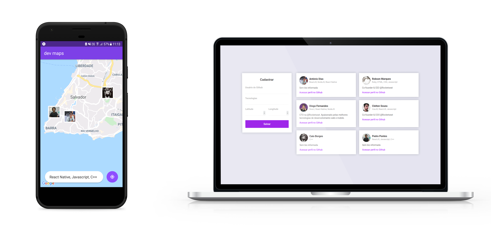

<h1 align="center">
    
</h1>

  
  
  

  

  

  <a href="#rocket-built-with">Built with</a>&nbsp;&nbsp;&nbsp;|&nbsp;&nbsp;&nbsp;
  <a href="#💻-about-the-project">About the project</a>&nbsp;&nbsp;&nbsp;|&nbsp;&nbsp;&nbsp;
  <a href="#🤔-how-to-contribute">How to contribute</a>&nbsp;&nbsp;&nbsp;|&nbsp;&nbsp;&nbsp;
  <a href="#memo-license">License</a>

 

  

## :rocket: Built with

This project was made using:

- [Node.js](https://nodejs.org/en/)
- [React](https://reactjs.org)
- [React Native](https://facebook.github.io/react-native/)
- [Expo](https://expo.io/)

## 💻 About the project

dev maps is a waze/maps-like app aimed at developers. Its purpose is to assist devs in finding each other, what is done by filtering using distance and mutual tecnologies.

This application was developed through the 10th OmniStack Week, promoted by [Rocketseat](https://rocketseat.com.br/). Special thanks to [Diego Fernandes](https://github.com/diego3g) for all the work he put into making this course.

## 🤔 How to contribute

- Fork this repository;
- Create a branch with your feature: `git checkout -b my-feature`;
- Commit your changes: `git commit -m 'feat: My new feature'`;
- Push to your branch: `git push origin my-feature`.

After your pull request has been merged, you can delete your branch.

## :memo: License

This project is under the MIT license. See [LICENSE](LICENSE.md) for more details.
